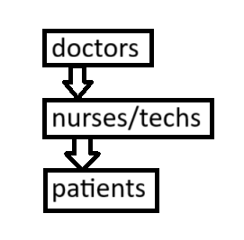
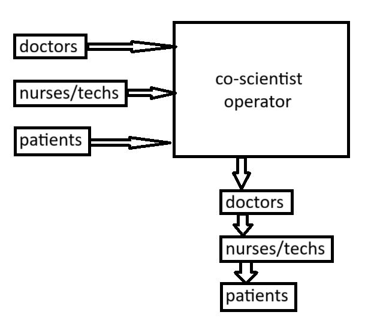

# Improving Healthcare Science
## Greg Sepesi, 11 November 2025

# 0. Executive summary
The following two paragraph executive summary was written by Gemini 2.5 deep research,
> "Improving Healthcare Science" argues that the stagnation in clinical outcomes, particularly in renal care, stems from a "Cargo Cult" approach to medicine—mimicking the forms of science without the requisite "scientific integrity" described by Richard Feynman. To counter this, the proposal suggests a dual strategy: reinstating the ethical discipline of "leaning over backwards" to disclose all conflicting information, and deploying Google DeepMind’s AI Co-scientist to augment human reasoning. By utilizing the AI's "generate, debate, and evolve" architecture, the plan aims to democratize high-level scientific inquiry, enabling frontline nurses and technicians to generate and continually refine hypotheses through "tournament evolution," thereby converting dialysis clinics from static service centers into active research environments.  
>
> The essay details two proof-of-concept applications: stabilizing hemoglobin levels using Control Theory principles and mitigating fruit fly infestations through environmental barriers rather than pesticides. To support these initiatives, the proposal outlines a rigorous privacy framework utilizing Android 15’s "Private Space" , which ensures patient data ownership and isolation through OS-level encryption. This technical layer is complemented by a "debt-free" economic model and a "hub-and-spoke" organizational structure designed to bypass institutional inertia, ensuring that data analysis—visualized through high-density "small multiple" plots—translates into verifiable clinical progress rather than mere procedural compliance.

# 1. Introduction
In 1965, [Richard Feynman](https://en.wikipedia.org/wiki/Richard_Feynman) received the Nobel Prize in Physics for his contributions to the development of quantum electrodynamics. In 1974, he gave a Caltech [commencement address](https://faculty.sites.iastate.edu/tesfatsi/archive/tesfatsi/CargoCultScience.RichardFeynman1974.pdf) in which he told a story about a society that wanted the benefits of scientific progress, and did what it imagined were the necessary steps to get that progress, but progress never happened because they lacked “scientific integrity.” In his commencement address Feynman explains,
  
> It's a kind of scientific integrity,
a principle of scientific thought that corresponds to a kind of utter honesty--a kind of
leaning over backwards. For example, if you're doing an experiment, you should report
everything that you think might make it invalid--not only what you think is right about
it: other causes that could possibly explain your results; and things you thought of that
you've eliminated by some other experiment, and how they worked--to make sure the
other fellow can tell they have been eliminated.
>
> Details that could throw doubt on your interpretation must be given, if you know them.
You must do the best you can--if you know anything at all wrong, or possibly wrong--
to explain it. If you make a theory, for example, and advertise it, or put it out, then you
must also put down all the facts that disagree with it, as well as those that agree with it. [...]
>
> In summary, the idea is to give all of the information to help others to judge the value
of your contribution; not just the information that leads to judgement in one particular
direction or another. [...]
>
> But this long history of learning how to not fool ourselves--of having utter scientific
integrity--is, I'm sorry to say, something that we haven't specifically included in any
particular course that I know of. We just hope you've caught on by osmosis.

Going beyond the hope of learning scientific integrity through osmosis that eventually leads to scientific progress, this essay proposes a two-pronged strategy for healthcare progress:
1. promote scientific integrity, which is an ethical standard as described by Richard Feynman, and
2. advance healthcare science, which is the outcome of debating and evolving hypotheses.

The first part of the strategy is old, matching Feynman's 1974 comments about scientific integrity:
* _"Utter honesty - a kind of leaning over backwards."_
* _"You must do the best you can - if you know anything at all wrong, or possibly wrong - to explain it."_
* _"In summary, the idea is to try to give all of the information to help others to judge the value of your contributions, not just the information that leads to judgement in one particular direction or another."_

The second part of the strategy is new: DeepMind's [co-scientist](https://research.google/blog/accelerating-scientific-breakthroughs-with-an-ai-co-scientist) is an AI agent that makes
* _"novel research hypotheses and proposals"_ through a
* _"generate, debate, and evolve"_ process, where _"debate"_ is
* _"tournament evolution"_ designed to rank and continually improve the healthcare ideas.

This combination of old and new strategies will be tested on two markedly different healthcare problems that are common in kidney dialysis clinics:
1. stabilize the hemoglobin levels of dialysis patients who are taking erythropoiesis-stimulating agents (ESAs),
2. reduce the fruit fly infestation in dialysis clinics by mechanically limiting access to food sources instead of frequently exposing the already vulnerable kidney dialysis patients to pesticides.

Both tests would quickly fail if they were simply added to the already full workload of personnel at the clinic. Instead, the tests will be merged with the full workload at the clinic according to [implementation research](https://en.wikipedia.org/wiki/Implementation_research), which accounts for the tendency of organizations with strong cultures to quickly reject any nonconforming practice. The expected impact of the two tests at the clinic is a significant increase in the number of patients with stable hemoglobin levels and a significant decrease in fruit flies in the clinic. However, a similar strategy could apply to many other dialysis clinics and many other healthcare fields.

# 2. Previous work
This proposal builds directly upon the following concepts and technologies.

## 2.1 The scientific method
The [scientific method](https://en.wikipedia.org/wiki/Scientific_method) is a set of core principles that guide inquiry.  It was slowly refined over millennia through contributions from multiple civilizations:

* A foundation based upon logic and [empiricism](https://en.wikipedia.org/wiki/Empiricism) first appeared in Ancient Greece.
* Systematic experimentation to test a [hypothesis](https://en.wikipedia.org/wiki/Hypothesis) was added by medieval Islamic scholars such as [Ibn al-Haytham](https://en.wikipedia.org/wiki/Ibn_al-Haytham) (Alhazen) in the 11th century. Other scholars of the era, like [Al-Biruni](https://en.wikipedia.org/wiki/Al-Biruni), recognized the need for replication.
* The method was formalized in 17th-century Europe. [Francis Bacon](https://en.wikipedia.org/wiki/Francis_Bacon) argued for [inductive reasoning](https://en.wikipedia.org/wiki/Inductive_reasoning) and systematic experimentation instead of assuming ancient authorities were correct. Contemporaries like [Galileo Galilei](https://en.wikipedia.org/wiki/Galileo_Galilei), [Johannes Kepler](https://en.wikipedia.org/wiki/Johannes_Kepler), and [Isaac Newton](https://en.wikipedia.org/wiki/Isaac_Newton) combined mathematical theory with empirical observation and experimentation, demonstrating the method's extraordinary potential.

## 2.2 Bundled payments for erythropoietin
Patients with failed kidneys often do not make enough [erythropoietin](https://en.wikipedia.org/wiki/Erythropoietin) and therefore develop [anemia](https://en.wikipedia.org/wiki/Anemia). That condition is so common among kidney dialysis patients that, prior to 2011 when the expensive erythropoiesis-stimulating agents (ESAs) were reimbursed as a fee-for-service, almost two thirds of the total income of dialysis clinics in the United States came from the administration of ESAs, such as epoetin alfa (EPO) and darbepoetin alfa (Aranesp). However, in January of 2011, the Centers for Medicare & Medicaid Services (CMS) implemented a "bundled" payment system that consolidated payment for a wide range of services and drugs, including ESAs and intravenous (IV) iron, into a single fixed payment per dialysis treatment.

As intended, the CMS policy change quickly reduced the overuse of ESAs by replacing the financial incentive for administering more ESAs with one for administering less. However, with the new policy, there was no new guidance on how to administer ESAs so that the patient's hemoglobin remained stable. Instead, hemoglobin oscillates between dangerously low and dangerously high levels. That condition, called hemoglobin cycling, is surprisingly common. For example, among the 281 patients [studied](https://pubmed.ncbi.nlm.nih.gov/16105069/) at the Winthrop-University Hospital Dialysis Centers, more than 90% experienced dangerously oscillating hemoglobin.

## 2.3 Hemoglobin level guidelines
The proper level of hemoglobin for kidney dialysis patients has been an evolving target. Prior to the CMS policy of bundled payments in 2011, the target was often a normalized hemoglobin level (i.e., the same hemoglobin level as a person with healthy kidneys, which is greater than 13 g/dL). However, in the early 2000s, trials such as the [Normal Hematocrit Trial](https://www.nejm.org/doi/full/10.1056/NEJM199808273390903) (NHT), the [Correction of Hemoglobin and Outcomes in Renal Insufficiency](https://clinicaltrials.gov/study/NCT00211120) (CHOIR) study, and the [trial of darbepoetin alfa in type 2 diabetes and chronic kidney disease](https://pubmed.ncbi.nlm.nih.gov/19880844/) demonstrated administering ESAs to target near-normal hemoglobin levels was associated with an increased risk of serious adverse events, including a risk of stroke, hypertension, and vascular access thrombosis. Today, according to the [Kidney Disease Improving Global Outcomes (KDIGO) guidelines](https://kdigo.org/guidelines/) (which can be slightly adjusted to accommodate treatment modalities and individual patient requirements), ESA treatment should be started when hemoglobin is below 10.0 g/dL, and should not exceed 11.5 g/dL while maintaining a TSAT>20% and Ferritin>100 ng/mL. (Note: TSAT is Transferrin Saturation.)

## 2.4 Edward Tufte's small multiple plot design
A typical health record plot shows a time series of measurements. If there are many time series, they can be difficult to compare. For example, the popular MyChart by Epic Systems Corporation shows approximately one time series per web browser page with excessive white space between plots. Therefore, comparing two or more time series in MyChart needlessly wastes the reader's working memory.

  

**Figure 2-1 Screenshot of MyChart by Epic Systems Corporation showing a time series of red blood cell count measurements and the normal range with a green background**  

n contrast to the style of MyChart plots, Edward Tufte's small multiple plots increase data density and therefore use less of the reader's working memory.² For example, Figure 2–2 displays the same red blood cell count time series as shown in Figure 2-1 but right next to other time series related to kidney function.

  

**Figure 2-2 Small multiple plots in a dashboard about kidney function (plotted by Julia and Makie). The proposed dashboards are organized by organ (e.g., kidney, heart, liver) instead of by blood test (e.g., Complete Blood Count). Each dashboard contains up to 16 time series small multiple plots (i.e., up to eight calendar time plots alongside their corresponding clock time plots).**  

## 2.5 Bayesian data analysis
The Reverend Thomas Bayes first described his innovative approach to calculating probabilities in 1763. In 1812, the French polymath Pierre-Simon Laplace further developed the Bayesian approach but these ideas were later challenged and largely forgotten until they were rediscovered by the British geophysicist and statistician Sir Harold Jeffreys in his 1939 book, Theory of Probability.

The current healthcare perspective on probability is often dichotomous. Evidence with very few examples (e.g., N<5) is frequently categorized as anecdotal with little clinical value, whereas evidence from large-scale randomized controlled trials (e.g., N>1000) is considered the gold standard. In contrast, this proposal uses Bayesian data analysis³ to formalize the presentation of anecdotal evidence and continually improve the confidence in that data analysis as more clinical examples become available. In other words, Bayesian data analysis continually learns and is expected to help fill a significant void between anecdotal evidence and expensive [RCTs](https://en.wikipedia.org/wiki/Randomized_controlled_trial). 

## 2.6 The Julia programming language
Started in 2009 and first publicly released in 2012, Julia is a free high-level programming language that is fast and particularly well suited for data analysis. Makie (pronounced mah-key) is a modern plotting library for Julia.

## 2.7 Spreadsheet applications
Introduced in 1969, the spreadsheet is a computer application that helps analyze data in tabular form. Spreadsheets gained widespread adoption with Microsoft Excel introduced in 1985.

## 2.8 Smartphones
The currently popular form of the smartphone with a large touchscreen display was introduced in 2007. Today's smartphones are powerful mobile computing devices with built-in cameras, built-in GPS navigation, and a growing list of artificial intelligence capabilities.

## 2.9 "Private Space" encrypted data on smartphone
There are several data privacy requirements for health data:
1. Health data must be private. Before HIPAA, there were instances of healthcare workers accessing the medical records of celebrities out of curiosity, not for treatment. Also, the emergence of the dark web created a marketplace for stolen health data. For example, patients could be blackmailed to avoid the public release of an HIV-positive diagnosis, which at one time could lead to loss of employment, housing, and personal relationships.
2. Health data must also be portable. Before HIPAA, "job lock" was a pervasive problem, where employees felt trapped in their current jobs for fear of losing their health insurance.
3. Health data must also be owned by the patients, not the providers or insurers. Before HIPAA, some providers denied patients access to their own health data, as leverage to collect an outstanding bill.
4. Health data sharing must be restricted to the "minimum necessary," to avoid the once common practice of sending a patient's entire medical record when only a single lab result is needed. This "minimum necessary" standard is the response to many documented data privacy breaches. For example, there was a documented case of a banker who also served on the county health board using his position on the health board to gain access to patient records. After identifying several individuals with cancer, he called in their mortgages, adding financial peril to an already troubling health condition. Another example of the need for the "minimum necessary" standard, a 30-year veteran of the FBI was placed on administrative leave after his pharmacy released information about his treatment for depression.
5. Health data must also have safeguards and accountability. Before HIPAA, a speculator in South Carolina purchased the entire set of patient records from a family practice at an auction for $4,000 and then started selling the records back to the former patients.

Android smartphones offer several levels of data security.
1. The least secure level (level 1) is only a thin veneer of secrecy, allowing users to "hide" the app's icon from being displayed by the app launcher (i.e., the home screen). However, nothing else about the hidden application changes: the application's data is visible in the file system and is unencrypted. This level is primarily intended as an approach to unclutter the home screen, not to secure anything.
2. A slightly more secure level (level 2) is a file vault that employs obfuscation and misdirection to "hide" data. The vault application is "disguised" as a common utility application (e.g., a calculator) in the home screen. Although the vault application can perform some utility functions, when the secret PIN is entered it reveals the files in the "vault." However, instead of employing cryptography to secure the files, these vaults usually employ simple obfuscation techniques (e.g., changing file extensions from .jpg to .dat, modifying the first few bytes of the file header to confuse file type identification, or placing the files in a "hidden" folder whose name starts with a '.'). This level is primarily intended for security against novice adversaries (e.g., children) because vaults are easily detected (e.g., the vault file size is unreasonably big for a simple utility application like a calculator) and the obfuscations are easily removed.
3. The most secure level (level 3) is called [Private Space](https://support.google.com/android/answer/15341885?hl=en) offering architectural isolation and data encryption. Private Space was first available in Android 15, released in October 2024. The security model of Private Space is stringent: when the space is locked, all applications within it are prevented from running background or foreground applications, cannot receive or display notifications, and are entirely hidden from system-wide file searches.

This proposal uses the level 3 security, Private Space on Android smartphones, to implement all five health data privacy requirements.

## 2.10 Artificial intelligence
The phrase "artificial intelligence" was coined in 1955 by John McCarthy who defined intelligence as "the computational part of the ability to achieve goals in the world." However, the field did not start its rapid growth until 2011, when [GPU](https://en.wikipedia.org/wiki/Graphics_processing_unit)s were first programmed to accelerate the training of neural networks.

Today, the capabilities of the neural-network-trained Large Language Models (LLMs) might be best described as uneven across tasks. For example, Google's Gemini deep research model is an extraordinary proofreader of essays (e.g., this one). Yet, that same LLM is not currently capable of transforming an English description of a desired plot into Makie code to plot it. Empowering healthcare professionals to write "prompt to plot" specifications to get helpful views of patient data is a key goal of this proposal.

## 2.11 Google Research's co-scientist
According to the Google Research paper [_Towards an AI co-scientist_](https://storage.googleapis.com/coscientist_paper/ai_coscientist.pdf),
> Scientific discovery relies on scientists generating novel hypotheses that undergo rigorous experimental
validation. To augment this process, we introduce an AI co-scientist, a multi-agent system built on Gemini
2.0. The AI co-scientist is intended to help uncover new, original knowledge and to formulate demonstrably
novel research hypotheses and proposals, building upon prior evidence and aligned to scientist-provided
research objectives and guidance. The system’s design incorporates a generate, debate, and evolve approach
to hypothesis generation, inspired by the scientific method and accelerated by scaling test-time compute.
Key contributions include: (1) a multi-agent architecture with an asynchronous task execution framework
for flexible compute scaling; (2) a tournament evolution process for self-improving hypotheses generation.
Automated evaluations show continued benefits of test-time compute, improving hypothesis quality.

# 3. Previous misdirected work
The project before this proposal was a patient health dashboard proposal. It was misdirected work because I was mistakenly focused on tooling (i.e., the visualization of the health status of a wide variety of patients) instead of being extremely focused on a specific problem (i.e., stabilizing the hemoglobin levels of kidney dialysis patients).

# 4. Architecture
A handful of simple structures summarize the proposed design.

## 4.1 Communication structure
Communication in a dialysis clinic is mostly command and control, which is particularly effective when there is an established standard of care that needs to be administered to hundreds of patients. In a dialysis clinic, instructions flow from the doctors to the patients. Data (e.g., [vital signs](https://en.wikipedia.org/wiki/Vital_signs)) flows in the opposite direction, from patients to doctors.

  
**Figure 4-1. Usual flow of communication in dialysis clinic**

In contrast, the proposed flow of communication is a combination of hub-and-spoke communication followed by the usual command and control communication. The hub-and-spoke communication is an attempt to avoid a bias against ideas from the nurses/technicians and the patients. To avoid conflicting with the usual command and control communication in the clinic, the hub-and-spoke communication will be a series of meetings outside the clinic (e.g., a nearby cafe or maker space) in which everyone has a chance to freely voice their ideas. The ideas will be ranked by the co-scientist and then delivered to the dialysis clinic doctors, where the ideas can be dispersed through the usual command and control communication in the clinic.

  
**Figure 4-2. Hub-and-spoke off-site communication followed by usual flow of communication in dialysis clinic.**
  
## 4.2 File structure
The data acquired for the proposed hemoglobin stability test and the fruit fly population control test will be stored in tab-separated ASCII text values, where each logged measurement has its own row in the text file. This simple file format makes importing the data into spreadsheet applications (for custom experimental analysis) simple (i.e., copy and paste).

To make the text file more compact, it will use numerical indices to reference look up tables of user choices (e.g., food, medication, medical device selections) instead of storing the possibly lengthy descriptions of those choices.

To reduce the burden of manual data entry, most of the logged measurements in this structured text file will be automatically extracted from unstructured data (i.e., extracted from smartphone camera images, for example images of food being weighed on a digital scale or images of the digital display of a blood pressure monitor).

## 4.3 Debt structure
To help ensure the features for the proposed tests remain aligned with customer needs (including affordable prices), feature development will be primarily funded by fees on optional features instead of by debt or venture capital.

## 4.4 Price structure
The concern about the high cost of healthcare often focuses on payment (e.g., health insurance subsidies) instead of efficiency. However, to significantly lower the cost of healthcare, more focus is needed on the efficiency of healthcare. For example, instead of treating dialysis patients individually to stabilize their hemoglobin levels, is it possible to treat them as a patient cohort? A cohort of patients with unstable hemoglobin levels (i.e., about 95% of dialysis patients receiving ESA treatments) can be automatically ranked and [triaged](https://en.wikipedia.org/wiki/Triage) according to their level of hemoglobin level instability. Then, healthcare from a human can be limited to just the third of the patient cohort needing the most help with stabilizing their hemoglobin levels. The other two thirds of the cohort can track their own progress in stabilizing their hemoglobin levels by seeing their automated ranking within their cohort. For example, "Congratulations, this month you have the third most stable hemoglobin level in your patient cohort."

In addition to increasing efficiency, another way to decrease the high cost of healthcare is to offer rewards that are highly valued but not monetary. Examples of non-monetary rewards that can be offered to dialysis clinic nurses and technicians (who are already receiving their base pay from the dialysis clinic) are
* a weekly free lunch with your closest coworkers,
* a chance to learn skills that are highly valued in the healthcare field,
* a chance to learn skills that are highly valued in other fields,
* the satisfaction of seeing the positive impact of your work, and
* recognition outside of your clinic.

A fair price must account for supply and demand, as in an [auction](https://en.wikipedia.org/wiki/Auction). The demand side will be a queue of requested scientific advancements along with the bonus price the requester is willing to pay if the requested scientific advancement is demonstrated to work reliably. The supply side will be a queue of available healthcare professionals along with their minimal bonus they are willing to accept for accomplishing a requested scientific advancement and their reputation score from previous work on requested scientific advancements. Fair prices will be set by matching items in the demand queue with items in the supply queue.

## 4.5 Growth structure
Even if a requested scientific advancement is demonstrated to work reliably in one dialysis clinic, the idea needs to spread to have a broad impact. This proposal promotes the spread of ideas in several ways:

1. **From person to person.** Starting with just two dialysis clinic nurses/technicians, they will be the ones to encourage some of their co-workers to join. 
2. **From business to business.** Peer-reviewed publications of clinical trial results seem more likely to spread ideas about requested scientific advancements than word of mouth because people might be reluctant to give tips that might help a competing dialysis clinic.
3. **From discipline to discipline.** Transferring ideas from one discipline to another is a key strength of the co-scientist AI agent because of its ability to quickly search through the publications in many disciplines. For example, the idea on how to stabilize hemoglobin comes from [control theory](https://en.wikipedia.org/wiki/Control_theory) and the idea on how to reduce the dialysis clinic fruit fly infestation comes from [entomology](https://en.wikipedia.org/wiki/Entomology).

# 5. Implementation strategy
For an idea for a requested scientific advancement to become a reliably working demonstration, it must pass all of the following checklist.
1. Is the problem well-defined?
2. Has the problem been sufficiently studied?
3. Is the problem easy to measure objectively?
4. Is the problem apparent in local data?
5. Is the solution affordable?
6. Is the solution easily explained (i.e., transparent)?
7. Is the solution reliable?
8. Is the rate of improvement fast enough (e.g., 10% improvement per week)?
9. Does the solution offer a significant (e.g., 2x) improvement over the original problem?

To avoid conflicting with the usual command and control communication pattern in the dialysis clinic, all discussions about the requested scientific advancement will be off-site (e.g., a nearby cafe or maker space). To avoid wasting time working on a dead-end, a requested scientific advancement with a currently stalled checklist is set aside and replaced by work on a different requested scientific advancement.

The solution to the requested scientific advancement is expected to steadily improve, as shown in the [documentation](https://research.google/blog/accelerating-scientific-breakthroughs-with-an-ai-co-scientist/) of the co-scientist, where the [ELO rating](https://en.wikipedia.org/wiki/Elo_rating_system) was a method originally for calculating the relative skill of chess players, but has been adopted to score the relative skill of professional sporting teams and, more recently, Large Language Models.

  
**Figure 5-1. Example of the continuing improvement of the co-scientist's hypotheses.**

This continuous improvement in working solutions developed by already-hired staff contrasts with consultants (who give advice but no implementation), sales engineers (who are embedded to make a demonstration but not a working solution) and software engineers (who maintain commercial, rather than custom, applications).

# 6. Possible objections
Because Improving Healthcare Science is a novel approach to testing and improving clinical care, the possible negative side effects must be considered and avoided. The following are common objections concerning AI.

## 6.1 It'll never work
**OBJECTION:** Given the significant hype surrounding artificial intelligence, claims that AI will meaningfully advance scientific discovery are met with considerable skepticism.    
**RESPONSE:** The group that developed co-scientist is the same group that developed [AlphaFold](https://en.wikipedia.org/wiki/AlphaFold), which had such a positive impact on science that the 2024 Nobel Prize in Chemistry was awarded to Demis Hassabis and John Jumper of Google DeepMind. While that is no guarantee that co-scientist will also have a positive impact on science, the stellar reputation of the group that developed co-scientist is not AI hype.

## 6.2 It'll take work from people
**OBJECTION:** Businesses are always looking for ways to cut labor costs. AI is just the latest approach.  
**RESPONSE:** [Geoffrey Hinton](https://en.wikipedia.org/wiki/Geoffrey_Hinton), often called _"The Godfather of AI"_ for his early role in the development of neural networks, won the 2024 Nobel Prize in Physics for his _"foundational discoveries and inventions that enable machine learning with artificial neural networks"_. In May 2023, Hinton resigned from his job at Google so that he could freely talk about the dangers of AI, including how it will take jobs from people. However, in this [YouTube interview](https://youtu.be/giT0ytynSqg?t=2530), Hinton says that healthcare is an exception because there is seemingly a limitless demand for more healthcare.
> "In other jobs, like in healthcare, they're much more elastic. So, if
you could make doctors five times as efficient, we could all have five times as much healthcare for the same price,
and that would be great. There's almost no limit to how much healthcare people can absorb. They always want more healthcare if there's no cost to it. There are jobs where you can make a
person with an AI assistant much more efficient and you won't lead to less people because you'll just have much
more of that being done."

As Hinton suggests, healthcare is a field where efficiency gains from AI are likely to expand services rather than displace labor due to high unmet demand. This proposal aligns with that view by focusing exclusively on augmenting the capabilities of healthcare professionals in a high-need area.

## 6.3 It'll further isolate people
**OBJECTION:** Doctors are already complaining that their interactions with patients are being replaced by interactions with a laptop because of electronic medical records. Interaction with an AI co-scientist would also replace interactions with people.  
**RESPONSE:** The increase in screen time is problematic in many fields, not just healthcare. Therefore, this Improving Healthcare Science proposal aims to increase interactions between people while not increasing interactions with screens. For example, the status and planning meetings involving the people stabilizing the hemoglobin levels of kidney dialysis patients will be held at a popular cafe near the dialysis center. The relaxed atmosphere of that cafe is expected to encourage interactions between people. The many hypothesis testing options presented by co-scientist will be reviewed like the many menu options available at the cafe: on paper, not on a screen.

## 6.4 It's inviting an AI overlord
**OBJECTION:** As AI capabilities increase, so does its ability to control people.  
**RESPONSE:** One of the ways that AI can manipulate people is through [sycophancy](https://en.wikipedia.org/wiki/Sycophancy). The scientific method is our best antidote against sycophancy and [cognitive biases](https://en.wikipedia.org/wiki/Cognitive_bias).

## 6.5 It's not a viable business
**OBJECTION:** With no competitive advantage, the business will fail.  
**RESPONSE:** The focus of Improving Healthcare Science is on solving patient problems (including affordability), not on maximizing profit. Therefore, many people would not consider it to be a business at all. In my opinion, it is more career development or continuing education than it is a business. However, each person using co-scientist must make the business decision of whether the rewards are greater than the investment in time.

# 7. Results
(TODO)

# 8. Conclusion
The job titles that currently employ the scientific method most frequently include medical scientist, research scientist, epidemiologist (i.e., disease detective), clinical research scientist, data scientists, and experimental psychologist. This essay proposes expanding the reach of the scientific method by bringing DeepMind's co-scientist AI agent to nurses and technicians within kidney dialysis clinics. The underlying premise is that nurses and technicians in kidney dialysis clinics frequently experience practical problems in their work and have plenty of good ideas to solve them but their work hours are already fully booked with doing tasks for the many dialysis patients and doing data collection for the doctors. What if, one lunch break per week, they were given the chance to openly discuss their healthcare ideas and possibly see them tested in a clinical trial? How rewarding would that be? If that concept works in a kidney dialysis clinic, would it also work with nurses and technicians in other medical fields?

# References
1. Shinners, Stanley M., [_Modern Control System Theory and Application_](https://www.amazon.com/Control-Application-Addison-Wesley-Electrical-Engineering/dp/020107494X), 2nd edition, Addison-Wesley, 1978. ISBN: 020107494X.
2. Tufte, Edward, [_The Visual Display of Quantitative Information_](https://www.amazon.com/Visual-Display-Quantitative-Information/dp/0961392142), 2nd edition, Graphics Press, 1997. ISBN: 0961392142.
3. Sivia, D.S., [_Data Analysis: A Bayesian Tutorial_](https://www.amazon.com/Data-Analysis-Bayesian-Devinderjit-Sivia/dp/0198568320), 2nd edition, Oxford University Press, 2006. ISBN: 0198568320.
4. Pearl, Judea, [_Causality: Models, Reasoning, and Inference_](https://www.amazon.com/Causality-Reasoning-Inference-Judea-Pearl/dp/052189560X), 2nd edition, Cambridge University Press, 2009. ISBN: 052189560X.
5. Kahneman, Daniel, [_Thinking, Fast and Slow_](https://www.amazon.com/Thinking-Fast-Slow-Daniel-Kahneman/dp/0374533555), 1st paperback edition, Farrar, Straus and Giroux, 2013. ISBN: ‎ 0374533555.
